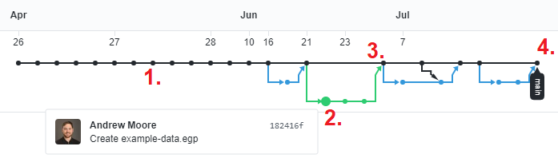
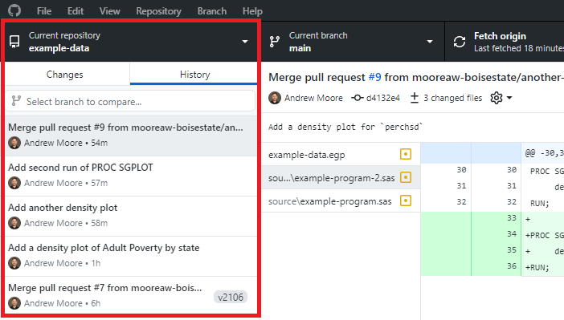
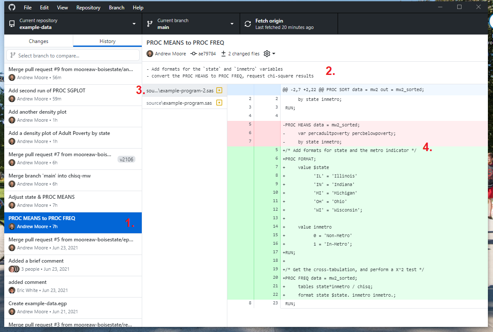
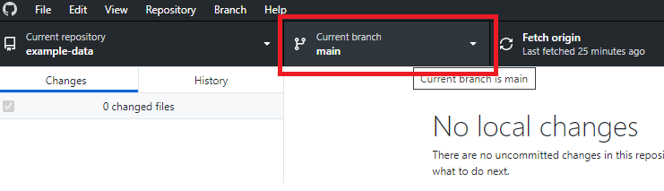
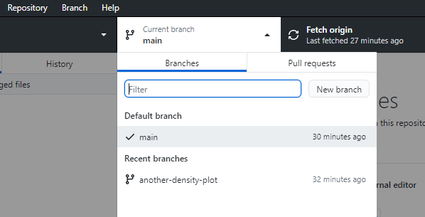
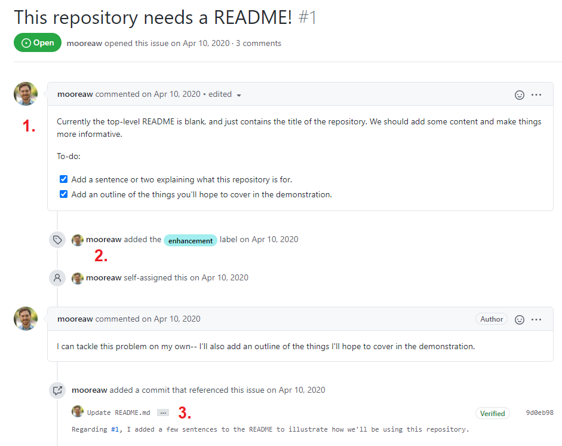
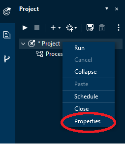
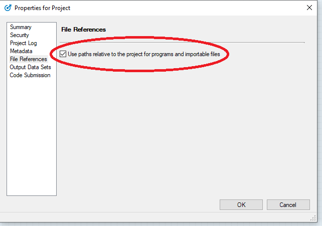
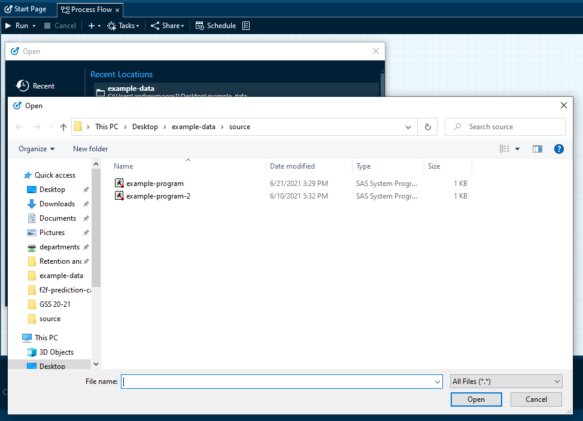

# Using Git/GitHub to Track Changes & Organize Project Code

## A note on this guide

Hi! This is meant to be a written resource to accompany other presentation materials on *Git* and version control for the office. One of the things that might be initially hard to follow are specific terms and vocabulary related to *Git*. When introducing new concepts, I'm going to use **bold** text to indicate keywords that are good to remember.

#### Table of Contents

- [What is Git?](#what-is-git?)
- [How does it work?](#how-does-it-work)
- [Working Locally](#working-locally)
- [Remote Repositories](#remote-repositories)
- [Branches](#branches)
- [Issue Tracking](#issue-tracking)
- [Pull Requests](#pull-requests)
- [Releases](#releases)
- [Creating a SAS Enterprise Guide Project for a Git Repository](#creating-a-sas-enterprise-guide-project-for-a-git-repository)
- [Markdown](#markdown)

## What is Git?

[*Git*](https://en.wikipedia.org/wiki/Git) is a popular tool for source version control used by software developers. Within the past 10 years, it's become more common for data scientists and research/data analysts to incorporate Git into their toolkits. Although we're not usually building whole applications or websites ourselves, we are managing software: our analysis code, SQL queries, and associated metadata. At the most basic level, each of these things can be stored as plain text files on a computer. In our day-to-day work, our code and queries often require modifications due to updates to our data systems, in response to changes in report specifications or improvements, or when projects expand or shrink in scope.

As we work on required changes, we'll often create different versions of code and test different approaches until a working product is finalized. It's also desirable to ensure that old code is never "lost", and that rationales for specific changes are stored. Git was designed to facilitate this process, and ensure that documenting different versions of code becomes natural to its development.

## How does it work?

*Git* sees the world in terms of project directories (or folders). When starting a new project, it's natural to create a new directory/folder and organize code, notes, and other materials in one place. We refer to project folders using Git as **repositories**. A repository can contain a single file, or hundreds, depending on the project's purpose. You can also place sub-folders within a repository. An example schema for organizing an analysis-centric repository for SAS code might look like this:

- `Name of Repository/`
    - `source/` (sub-folder, contains programs used in the project)
    - `output/` (sub-folder, contains outputs such as excel files, plots, or reports)
        - these files probably shouldn't be version-controlled on GitHub, and results that are ultimately meant to fulfill submissions/requests should be stored separately on the R-drive
    - `data/`   (sub-folder, contains raw data that isn't produced as a result of queries/code)
        - same as above
    - `docs/`   (sub-folder, contains detailed information on project processes that aren't captured as comments)
    - `README.md` (text file, contains high-level info about the project, instructions on how to run analyses, etc.)
    - `project-name.epg` (SAS Enterprise Guide Project file, stores representation of project workspace)
        - *Note:* these EPG files may contain HTML outputs from `PROC`s, so it's important to prevent sensitive information from being printed (or to delete these HTML files before committing changes to the EPG file).

Each file and folder placed in a Git repository can be tracked (although, as I mentioned above, there are some that might be worth excluding due to privacy/security concerns). When you create, modify, or delete one or more files in a repository, you can save the state of the file(s) with a **commit.** When committing one or more files, you're taking a snapshot of the file(s), telling Git to preserve what things look like when you make the commit. This is a little different from how version control works in (for example) Google Docs, but with computer code, we often test things that might not work at first. It's helpful to not preserve changes until we know we're ready. Once you've modified every file related to a change or request, you **stage** the files, and write a **commit message** that briefly summarizes what you've modified.

Commits are linked together on **branches.** I'll discuss this concept in more detail later, but for now, think of each commit as growth on a tree. Below is an annotated view of the commits in an example repository. It's presented as a timeline, with the first commit occurring on 4/26.



1. Each individual commit is a dot on the timeline. You can see that lots of development could take place on the same day, or commits might be spaced out over time.

2. Here we see a development branch that diverged from the project main. I've hovered over one of the commits, so you can see its summary, the author, and its unique identifier. Two more commits were added after it on this branch.

3. Now we see the commits from the green branch being *merged* back onto the project `main`. This commit is referred to as a *merge commit*. As you can see later on 7/7, you're free to merge from `main` back onto the development branch, too. Here, you can think of this as bringing the development branch back up to sync with `main`. Any branch within a repository can be merged to another branch within the same repository (assuming there aren't direct conflicts on edits between modified files; in this case, you'd need to decide which versions to keep).

4. The most recent commit is referred to as the branch's **head.** This is the current state of the project.

## Working Locally

So, what does this look like in practice? We get a running history that marks changes to files over time, with explanations/descriptions of edits by each author. Starting now, I'll show some examples from a local repository used to track code for the PMAP/SLDS project. Here's a snapshot of the commit history for the repository (highlighted in red). I'm using GitHub's desktop application to view things.



You can see the summary (kind of like an email subject) for each commit in **Bold**, with my name underneath it, as well as the date/time I made the commit. This is a high-level view of activity on the project. Next we'll dive into a single commit to see the other kinds of information that's stored.



I've annotated different parts of this screenshot with numbers.

1. Here, the commit is highlighted in the history, indicating which commit we're looking at.

2. In addition to the summary and author, we also get a bit more information in this panel. We see the last few characters of a *unique hash* for the commit (`ae79784`), the *number of files changed*, and *more detailed notes* that I added to summarize my changes.

3. In the next panel, we see which file is selected for viewing, which is more darkly shaded. In this case, we're looking at a program called `example-program-2.sas`.

4. Lastly we have the _**diff**(erence)s_ that I introduced with the commit. (These are sometimes just called "diff"s.) In green, you see my _additions_ to the code. In red, you see my _deletions_. This means that if you wanted to go back for a piece of code that interests you (but was ultimately not used), you can see where/when it was removed. This also means you don't need to keep old code that's been commented out, which can reduce clutter in a program.

So, at this point we have the ingredients for a basic workflow. You organize programs and documentation within a special directory on your computer, a local **repository**, and preserve changes to programs/project state using **commits**. Each commit is made on a **branch** (usually called `main`), and the most recent commit to a branch is called the branch **head**. Each commit has a unique hash to identify it, a **commit message** with a summary/description, and is accompanied by a line-by-line **diff** that shows the changes made.

## Remote Repositories

Working locally with a Git repository is fine and can be helpful, but it's more common to be working/sharing code in collaboration with others. Version control becomes even more important when you have multiple authors making changes to the same set of project code! In order to collaborate, we need a way to make our work accessible to others. This is where we introduce the concept of a **remote** repository. The **remote** repository is meant to be the *source of truth* for a project, and a website/server like GitHub serves as its host. The workflow moves from one person maintaining a personal (local) repository, into one where multiple people are keeping their projects synced with the remote (source of truth).

If I'm starting work on a pre-existing project, I can **clone** the remote repository onto my computer, and start working on changes I'm interested in making. When I'm finished with the code I'm working on, I preserve it as a commit, and then **push** my results to the remote repository. My colleagues will then be able to update their own local repositories by **pull**ing these changes down.

*Interlude:* Cloning a git repository, making changes, and pushing, using GitHub Desktop and SAS EPG.

[Panopto Link.](https://boisestate.hosted.panopto.com/Panopto/Pages/Viewer.aspx?id=953dc393-0c3e-4819-9bdf-ad5e015cee11) (Boise State login required.)


## Branches

Earlier when introducing Git, I touched on the concept of **branches**. To further expand on the topic, every repository has at least 1 branch. It's referred to as the **main** (or master) branch. Based on needs and preferences, a project may only use the project `main`. However, branches can be used to isolate code that is being developed from code that is stable (or pre-existing). Keeping new versions of code separate until it's complete is a natural way to control how/when changes are introduced, and GitHub has some useful functionality to track progress on branches, and facilitate communication.

### Checking out a branch

When switching to a branch, Git automatically updates your repository's files to ensure you're looking at match what's been done on the branch you're checking-out. Just like with the `main` branch, you'll need to make sure you pull down changes from the remote if more than one person is developing on a branch.

Tracking your current branch is easy with GitHub Desktop. It's prominently featured at the top of the application window.



If you click on this panel, a dropdown with available branches appears. You can then switch to an available branch by clicking on it in the dropdown, or create a new branch.



### Merging

Once you've finished work on a branch, in most cases you'll want to integrate the development branch's commits back into the project `main`. This is referred to as **merging** a branch. While the `development` -> `main` flow is quite common, you can merge any two branches within a repository. It's good practice to document a merge using a **pull request**, and this topic is covered in more detail in a later section. Most of the time merges can be performed automatically by Git, but occasionally you might have scenarios where two authors edited the same lines of code across two different branches. This generates a **merge conflict**, and must be resolved manually. It might sound a little scary, but in essence, you're just working out which version of the code will be retained. Merge conflicts can also be generated when you have a static file (e.g. a PDF or image) that was updated separately on two different branches. The idea is similar-- you'll need to tell Git which file will be retained in the merge. Once each potential conflict is resolved, the results are marked in a **merge commit**. Good communication across teammates can prevent many merge conflicts, but they still happen from time-to-time, and they're (usually) pretty simple to clear up.

An overview of merge conflicts can be found here: https://docs.github.com/en/github/collaborating-with-pull-requests/addressing-merge-conflicts/about-merge-conflicts

## Issue Tracking

If our code never changed, we wouldn't need version control. But, updates are frequently prompted by bugs, or necessary changes as the project evolves. You might say these are **issues** that have to be resolved, and GitHub has a tracking system to facilitate this. Issues are opened and viewed on GitHub.com. We'll look at an issue I opened in an example repository.



1. Here's the initial description of the issue. The author of the issue notes problems or things that should be updated/changed so that others can help. Note how I can add check-boxes in the description-- these can be toggled as complete by anyone working on the project. They're not binding, but can be helpful for organizing sub-tasks.

2. Issues can be categorized with *labels* (such as "enhancement", "bug", or "help wanted", etc.). They can also be assigned to particular collaborators if they volunteer or are best fits for solving an issue. Here I've tasked this issue for myself.

3. When making changes to the project via commits, you can reference the issue to attach commits to an issue's conversation/thread. Each issue gets a *number* assigned to it (say #1), and can be tagged in commits or other comments on the repository by including "#1" in a message. Note also the unique hash/id for the commit (`9d0eb98`); clicking this or the subject line for the commit (next to my profile picture) will take me to the commit itself, if I wanted to see the specific changes.

If you'd like to explore an issue on your own, here's one you can look through in a different sandbox repository: https://github.com/mooreaw-boisestate/example-data/issues/2

We'll discuss this more in a following section, but note how the issue I linked to above is able to *reference* or link to pull requests and commits, and these instances show up in the timeline/feed of the issue. You can click-through these references to see how things were connected. This issue was ultimately resolved through a pull request ([#3](https://github.com/mooreaw-boisestate/example-data/pull/3)).

## Pull Requests

We've been building up to one of the most important topics! In Git/GitHub vernacular, **pull requests** (**PR**s) are how formal changes are proposed to project code.

TODO TODO TODO

*Interlude:* Creating a branch in GitHub desktop, making changes on the branch, and opening a Pull Request.

[Panopto Link.](https://boisestate.hosted.panopto.com/Panopto/Pages/Viewer.aspx?id=5f6e7274-4f0e-4e07-b409-ad5e016479bc) (Boise State login required.)

## Releases

Releases are used to denote specific snapshots of a repository in time. For traditional software, they're used to denote points when the code or application was stable and ready for its intended users (or at least beta/alpha testers). In an analysis or reporting framework, releases can be helpful to mark instances when a piece of code was used to deliver a report. When you create a release, you are able to write a summary, attach files (images, PDFs, etc.), and most importantly, all the repository's code (as-of the commit tied to the release) is bundled and available for download as a Zip file.

This is very useful, given that we often need to examine a project's state at a particular point in time to examine discrepancies or specific changes. You could imagine releases being tagged for code dedicated to reoccurring/seasonal deliverables, such as IPEDS submissions, or US News submissions.

Over time, GitHub also enables comparisons of source-code across releases, so some of the analysis of changes can be summarized quickly.

- An example release can be found here: https://github.com/mooreaw-boisestate/example-data/releases/tag/v2106

- For an example of a comparison across two releases, here's an open-source project: https://github.com/tidyverse/dplyr/compare/v1.0.6...v1.0.7
  - In this release, you can see that 17 files were changed, and both a timeline and diffs are available for view.

## Creating a SAS Enterprise Guide Project for a Git Repository

Steps must be completed in order:

1. Create a brand-new SAS Enterprise Guide Project.
2. Inside the project, Properties > File References: check "Use paths relative to the project for programs and importable files."
3. Save the project inside the Git repository (preferably at the top-level).
4. **Open** the source files from the Git repository.
5. Save the project.







The source files will be marked as *shortcuts* to the place they're stored in the Git Repo, rather than embedded in the project file. However, if you pass the project folder to someone else, the relative paths should ensure they can open things up and run the code.

## Markdown

As you have seen, a lot of what Git/GitHub facilitates is communication and documentation. Thus, writing is a pretty important part of working with this tool! In many places you can write text, GitHub can interpret it as [***Markdown***](https://guides.github.com/features/mastering-markdown/). Markdown is a lightweight syntax for styling writing/text on the web. Mostly, it looks like regular text, but certain symbols are used to denote formatting.

Some places where GitHub will recognize markdown formatting are:

- Issue/Pull-Request Descriptions
- Comments in Issues or Pull Requests
- Files with a `.md` or `.markdown` extension

Reading through this guide is highly recommended (and it's short!): https://guides.github.com/features/mastering-markdown/

#### Examples

**Text**

```
Here's how to make some words **bold** and other words *italic* with Markdown.
You can add [links to other websites!](https://boisestate.edu)
```
Here's how to make some words **bold** and other words *italic* with Markdown.
You can add [links to other websites!](https://boisestate.edu)

**Lists**

```
Numbered lists:

1. One Fish
2. Two Fish
3. Red Fish
4. Blue Fish

Bullet Points:

* Starting with a star
+ Or a plus
- Or a dash
  * Sub points can be added by putting two spaces before the dash/star/plus
  - I usually use dashes, and stick to a single symbol to denote bullets within a list. Stars (`*`) aren't ideal, because they're also used for *emphasis/bolding.*
```

Numbered lists:

1. One Fish
2. Two Fish
3. Red Fish
4. Blue Fish

Bullet Points:

* Starting with a star
+ Or a plus
- Or a dash
  * Sub points can be added by putting two spaces before the dash/star/plus
  - I usually use dashes, and stick to a single symbol to denote bullets within a list. Stars (`*`) aren't ideal, because they're also used for *emphasis/bolding.*
